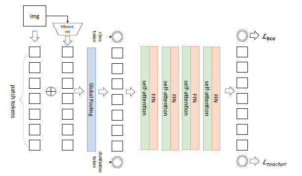
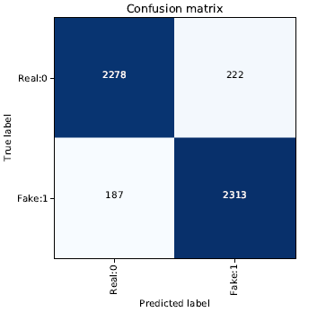
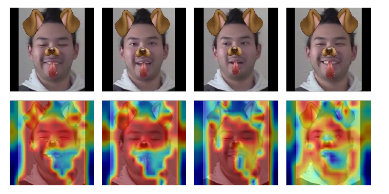

## Efficient Deepfake Detection Technique Based on Vision Transformer and Distillation
Pubkished paper : https://arxiv.org/pdf/2104.01353.pdf \
Young-Jin Heo, Woon-Ha Yeo, Byung-Gyu Kim*, "Deepfake Detection Algorithm Based on Improved Vision Transformer," Applied Intelligence (Springer), (https://doi.org/10.1007/s10489-022-03867-9), July 26, 2022 (online first) 

### code reference  
This code is based on @selim of DeepfakeDetection challenge \
We change modeling part and training method \
https://github.com/selimsef/dfdc_deepfake_challenge.git

vision transformer model of timm \
https://github.com/rwightman/pytorch-image-models/blob/master/timm/models/vision_transformer.py

### challenge
[Deepfake Detection Challenge June 25, 2020 facebook AI](https://ai.facebook.com/datasets/dfdc/) \
paper \
[The DeepFake Detection Challenge (DFDC) Dataset Paper](https://arxiv.org/abs/2006.07397)


## environment
- Ubuntu 18.04 with TITAN RTX
- Dependencies:
- Cuda 10.1
- python 3.7.0
- torch 1.7.1
- torchvision 0.8.2
- timm 0.3.2

## environment setting
```
apt-get update && apt-get install -y libglib2.0-0 libsm6 libxrender-dev libxext6 nano mc glances vim

#install cython
conda install cython -y && conda clean --all

#install APEX
pip install -U pip
git clone https://github.com/NVIDIA/apex
sed -i 's/check_cuda_torch_binary_vs_bare_metal(torch.utils.cpp_extension.CUDA_HOME)/pass/g' apex/setup.py
pip install -v --no-cache-dir --global-option="--cpp_ext" --global-option="--cuda_ext"  ./apex
apt-get update -y
apt-get install build-essential cmake -y
apt-get install libopenblas-dev liblapack-dev -y
apt-get install libx11-dev libgtk-3-dev -y
pip install dlib
pip install facenet-pytorch
pip install timm
conda install \
              pyhamcrest \
              cython \
              fiona \
              h5py \
              jupyter \
              jupyterlab \
              ipykernel \
              matplotlib \
	      ncurses \
              numpy \
	      statsmodels \
              pandas \
              pillow \
              pip \
              scipy \
              scikit-image \
              scikit-learn \
              testpath \
              tqdm \
              pandas \
	      opencv \
	&& conda clean -p \
	&& conda clean -t \
	&& conda clean --yes --all
pip install albumentations timm pytorch_toolbelt tensorboardx

```


## description 
This project is deepfake detection algorithm based on [DeiT](https://arxiv.org/abs/2012.12877). \
Usually, deepfake detection model is CNN structure, but we utilize [Vision Transformer](https://arxiv.org/abs/2010.11929).


#### folder
- configs : model, parameter setting
- libs : using for generating face landmarks
- logs : saving validation loss when training
- preprocessing : before training, we have to crop the face from video
- training : for training
	* datasets : import dataset when training
	* pipelines : main file here (train_classifier.py)
	* tools : utils
	* transforms : data augmentation (albu)
	* zoo : deepfake detection model here (classifiers.py)
- weights : for saving model's weights
- CAM : visualizing model's weights ([code reference](https://github.com/KangBK0120/CAM.git))

#### main files

- facebook_deit.py : deit, vision transformer model here
- training/pipelines/train_classifier.py : main.py file, training here
- datasets/classifier_dataset.py : load training, validation dataset here
- zoo/classifiers.py : deepfake detection model here
- predict_folder.py : get test probability result with test dataset
- compute_final_loss.py : get AUC score from .csv file
- plot_loss.py : get validation loss graph from logs/~
- train.sh : execution main training python file
- predict_submission.sh : execution test python file

#### Model
We consider CNN feature and PatchEmbedding feature both \
 \
we utilize [DeiT](https://arxiv.org/abs/2012.12877) deep learning model. The image split into patches and pass the EffcientNet. We got (Batch, N, embedding features), (Batch, M, embedding features) respectively. These tokens are concatenated, through global pooling, and fed to the transformer encoder. The encoder consists of Multi-Self Attention (MSA) and 2 layers of GeLU function. Distillation token is trained by the teacher network (E7).

## Pretrained models
download_weights.sh script will download trained models to weights/ folder. They should be downloaded before training and testing.

## preprocessing
reference : https://github.com/selimsef/dfdc_deepfake_challenge.git \
summerizing @selim dfdc code \
root_dir = training dataset directory \
(dfdc_train_xxx folder must be prepared)


##### 1. Find face bboxes
`python preprocessing/detect_original_faces.py --root-dir trainig_dataset_directory`

##### 2. Extract crops from videos

`python preprocessing/extract_crops.py --root-dir trainig_dataset_directory --crops-dir crops`
 
##### 3. Generate landmarks
`python preprocessing/generate_landmarks.py --root-dir trainig_dataset_directory`
 
##### 4. Generate diff SSIM masks
`python preprocessing/generate_diffs.py --root-dir trainig_dataset_directory`

##### 5. Generate folds
`python preprocessing/generate_folds.py --root-dir trainig_dataset_directory --out folds.csv`


##### or 

`sh preprocess_data.sh
`

## Training

**`sh train.sh`** (EfficientNet-B7) \
**`sh train-vit.sh`** (Vision Transformer) \
**`sh train-distill.sh`** (DeiT)


During training checkpoints are saved for every epoch.

#### or
```
python -u -m torch.distributed.launch --nproc_per_node=$NUM_GPUS --master_port 9901 training/pipelines/train_classifier.py \
 --distributed --config configs/deit_distill.json --freeze-epochs 0 --test_every 1 --opt-level O1 --label-smoothing 0.01 --folds-csv folds.csv  --fold 0 --seed 111 --data-dir $ROOT_DIR --prefix deit_d_111_ > logs/deit_d_111
```

#### parameter setting
**`deit_distill.json`** :
```
{
    "network": "DeepFakeClassifier_Distill",
    "encoder": "deit_distill_large_patch32_384",
    "batches_per_epoch": 2500,
    "size": 384,
    "fp16": true,
    "optimizer": {
        "batch_size": 12,
        "type": "SGD",
        "momentum": 0.9,
        "weight_decay": 1e-4,
        "learning_rate": 0.01,
        "nesterov": true,
        "schedule": {
            "type": "poly",
            "mode": "step",
            "epochs": 40,
            "params": {"max_iter":  100500}
        }
    },
    "normalize": {
        "mean": [0.485, 0.456, 0.406],
        "std": [0.229, 0.224, 0.225]
    },
    "losses": {
        "BinaryCrossentropy": 1
    }
}
```
## Plotting losses to select checkpoints

`python plot_loss.py --log-file logs/<log file>`


## Testing

`sh predict_submission_vit.sh`

#### or

```
TEST_DIR=$1
CSV=$2

python predict_folder.py \
 --test-dir $TEST_DIR \
 --output $CSV \
 --models deit_d_111_DeepFakeClassifier_Distill_deit_distill_large_patch32_384_0_last \
 deit_d_555_DeepFakeClassifier_Distill_deit_distill_large_patch32_384_0_last \
 deit_d_777_DeepFakeClassifier_Distill_deit_distill_large_patch32_384_0_last \
 deit_d_888_DeepFakeClassifier_Distill_deit_distill_large_patch32_384_0_last \
 deit_d_999_DeepFakeClassifier_Distill_deit_distill_large_patch32_384_0_last
```

## AUC, loss
`python compute_final_loss.py`

change csv file
```python
test_path = '/home/yjheo/Deepfake/dataset/dfdc_facebook/test/labels.csv' #label
label = pd.read_csv(test_path)
predict = pd.read_csv('SOTA_last_weight.csv') #prediction1
predict2 = pd.read_csv('ViT_Distill_last_weight.csv') #prediction2
```
#### EfficientNet confusion matrix

#### Our Model confusion matrix



## ViT CAM
```
python create_cam.py --dataset OWN --dataset_path ./images --model_path $Weight_path --model_name $Model_name
```



## testing images
TEST_DIR = png image root path
```
TEST_DIR=$1
CSV=$2

python predict_images.py \
 --test-dir $TEST_DIR \
 --output $CSV \
 --models deit_d_111_DeepFakeClassifier_Distill_deit_distill_large_patch32_384_0_last \
 deit_d_555_DeepFakeClassifier_Distill_deit_distill_large_patch32_384_0_last \
 deit_d_777_DeepFakeClassifier_Distill_deit_distill_large_patch32_384_0_last \
 deit_d_888_DeepFakeClassifier_Distill_deit_distill_large_patch32_384_0_last \
 deit_d_999_DeepFakeClassifier_Distill_deit_distill_large_patch32_384_0_last
```
